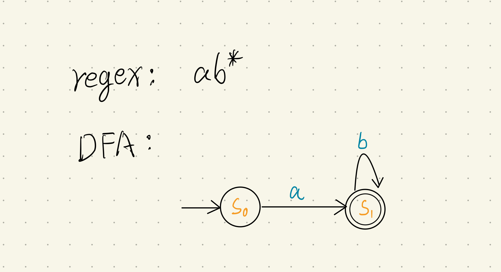

# DFA-Verifier
A CLI app for verifying that a DFA is the same as its Regular Expression representation. 

## Introduction
A regular language can be defined by either Determistic Finite Automata (DFA) or Regular Expression (RE).  It's essential to make sure that the two are representing the same language.

This tool can help to test it.

### DFA Representation
We can write DFA as a four-tuple (S, Σ, δ, s0, SA):
S is the finite set of states in DFA
Σ is the vocabulary
δ is the function or the edges in DFA
s0 is the starting state
SA is the set of accepting states


### RE Representation
It's the normal Regex format

### Example
For regex and DFA like this:



We can have a json file with such input:
```JSON
{
  "regex": "ab*",
  "S": ["s0", "s1"],
  "vocabulary": ["a", "b"],
  "function": [
    ["s0", "a", "s1"],
    ["s1", "b", "s1"]
  ],
  "s0": "s0",
  "SA": ["s1"]
}
```
## Usage
```
usage: java -jar DFA-Verfier.jar -i <input-file> [-q|-r|-t]
 -i <arg>   input DFS description file
 -q         only show the result
 -r <arg>   number of tests to run, default 100
 -t         only show failed tests

```